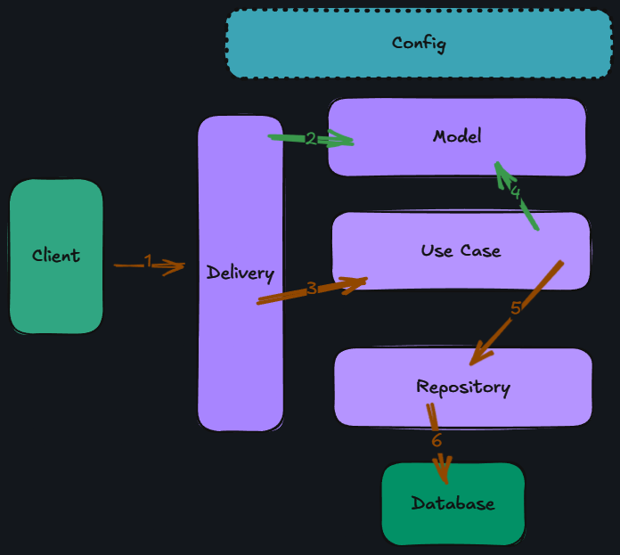

# Railway Tiket Go

# Description
A clean-architecture backend API built in Go for a railway ticket reservation system. This project simulates real-world booking logic — including user and guest sessions, secure token authentication, seat locking prevent double booking, discount application, and auto-cleanup of expired unpaid reservations.

---

## Architecture


1. External system perform request 
2. The Delivery creates various Model from request data
3. The Delivery calls Use Case, and exucute it using Model data
4. The Use Case create Model data for the business logic
5. The Use Case calls Repository, and execute it using Model data
6. The Repository perform database operation to the database

## Features

- [x] **Authentication & Authorization**
  -  User and guest login sessions using Redis
  -  Secure PASETO tokens
  -  Role-based access (e.g., admin and general affairs only endpoints)

- [x] **Train Ticket Reservation**
  -  Real-time seat locking using Redis
  -  Double-booking prevention with transactional PostgreSQL
  -  Reservation TTL and auto-expiration

- [x] **Pricing & Discounts**
  -  Apply a flat percentage-based discount via a discount code
  -  Supports discount expiration and percent-based reductions

- [x] **Payment Simulation**
  -  Mock payment endpoint and webhook
  -  Status: `pending`, `success`, `cancelled`

- [x] **Auto Cleanup Jobs**
  - Deletes unpaid reservations after expiration
  - Runs every 5 minutes (native Go goroutine)

## Tech Stack

- Golang : https://github.com/golang/go
- PostgreSQL (Database) : https://www.postgresql.org

## Framework & Library

- HTTP Framework  : Fiber (https://gofiber.io/)                  
- Auth Tokens : PASETO (https://paseto.io/)                  
- Session Store : Redis (https://github.com/redis/redis)      
- Configuration : Viper (https://github.com/spf13/viper)     
- Logging : Zap (https://github.com/uber-go/zap)       
- Validation : Go Playground Validator (https://github.com/go-playground/validator)
- Database Migration : Golang Migrate (https://github.com/golang-migrate/migrate)
- Task Runner or Build Tool : Go-task (https://github.com/go-task/task)

## Configuration

All configuration is in `config.json`.

## API Spec

All API spec is in `api` folder.

## Database Migration

All database migration is in `db/migration` folder.

## Getting Started

### 1. Clone & Configure

```bash
git clone https://github.com/maiing11/railway-go.git
cd railway-go
cp config.example.json config.json
```

### 2. Start Services (PostgreSQL + Redis)

```bash
docker compose up -d
```

### 3. Run Tasks with Taskfile
Install Task (if not yet):
```bash
brew install go-task/tap/go-task  # or see taskfile.dev/#/installation
```

Then use predefined commands (see taskfile.yml):
```bash
task migrateup # run migrations
task start # run app, docker compose up --build -d
task stop # run docker compose down
```
## Testing
- [ ] Seat locking and double-booking logic

- [ ] Reservation and payment transaction

- [ ] Cron job: AutoCancelExpiredReservations()

*Unit and integration tests coming soon*

## Learning Highlights
This project demonstrates:

✅ Clean architecture in Go

✅ Secure auth with PASETO

✅ Distributed locking using Redis

✅ Payment simulation with status update

✅ SQLC + pgx PostgreSQL integration

✅ Periodic background tasks in Go

